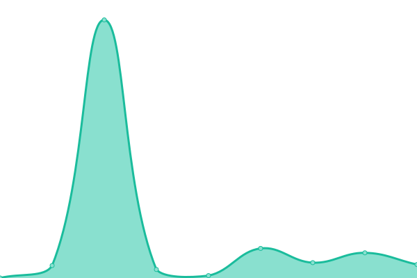
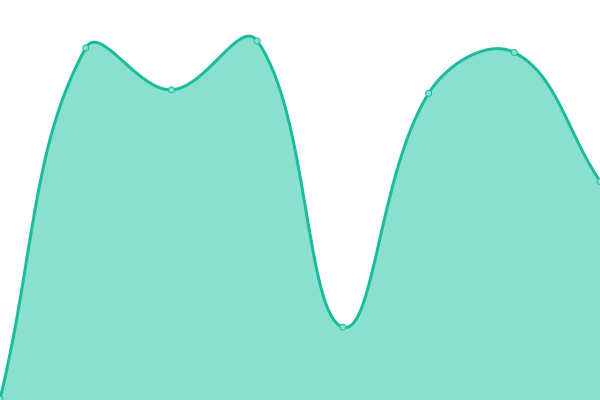
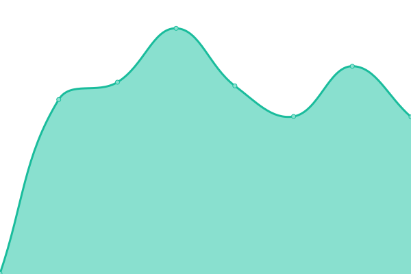

# [📈 Live Status](https://uptime.soneji.xyz): <!--live status--> **🟧 Partial outage**

This repository contains the open-source uptime monitor and status page for [Dhaval Soneji](https://soneji.xyz), powered by [Upptime](https://github.com/upptime/upptime).

With [Upptime](https://upptime.js.org), you can get your own unlimited and free uptime monitor and status page, powered entirely by a GitHub repository. We use [Issues](https://github.com/soneji/upptime/issues) as incident reports, [Actions](https://github.com/soneji/upptime/actions) as uptime monitors, and [Pages](https://uptime.soneji.xyz) for the status page.

<!--start: status pages-->
<!-- This summary is generated by Upptime (https://github.com/upptime/upptime) -->
<!-- Do not edit this manually, your changes will be overwritten -->
<!-- prettier-ignore -->
| URL | Status | History | Response Time | Uptime |
| --- | ------ | ------- | ------------- | ------ |
|  [soneji.xyz](soneji.xyz) | 🟩 Up | [soneji-xyz.yml](https://github.com/Soneji/uptime/commits/HEAD/history/soneji-xyz.yml) | 

 245ms
     
 | 

<a href="https://uptime.soneji.xyz/history/soneji-xyz">100.00%</a>
    

|  [dhavalsoneji.com](dhavalsoneji.com) | 🟩 Up | [dhavalsoneji-com.yml](https://github.com/Soneji/uptime/commits/HEAD/history/dhavalsoneji-com.yml) | 

 76ms
     
 | 

<a href="https://uptime.soneji.xyz/history/dhavalsoneji-com">100.00%</a>
    

|  [Spotify Vibe Check](spotify-vibe-check.soneji.xyz) | 🟥 Down | [spotify-vibe-check.yml](https://github.com/Soneji/uptime/commits/HEAD/history/spotify-vibe-check.yml) | 

 645ms
     
 | 

<a href="https://uptime.soneji.xyz/history/spotify-vibe-check">77.92%</a>
    

|  [CTF](https://ctf.soneji.xyz) | 🟩 Up | [ctf.yml](https://github.com/Soneji/uptime/commits/HEAD/history/ctf.yml) | 

 280ms
     
 | 

<a href="https://uptime.soneji.xyz/history/ctf">80.99%</a>
    

|  LTT | 🟩 Up | [ltt.yml](https://github.com/Soneji/uptime/commits/HEAD/history/ltt.yml) | 

 204ms
     
 | 

<a href="https://uptime.soneji.xyz/history/ltt">100.00%</a>
    

|  [Shynet Analytics](https://shynetanalytics.com) | 🟩 Up | [shynet-analytics.yml](https://github.com/Soneji/uptime/commits/HEAD/history/shynet-analytics.yml) | 

 611ms
     
 | 

<a href="https://uptime.soneji.xyz/history/shynet-analytics">100.00%</a>
    

|  Venom | 🟩 Up | [venom.yml](https://github.com/Soneji/uptime/commits/HEAD/history/venom.yml) | 

 196ms
     
 | 

<a href="https://uptime.soneji.xyz/history/venom">100.00%</a>
    

|  Javamail | 🟩 Up | [javamail.yml](https://github.com/Soneji/uptime/commits/HEAD/history/javamail.yml) | 

 224ms
     
 | 

<a href="https://uptime.soneji.xyz/history/javamail">100.00%</a>
    

|  Chrome | 🟥 Down | [chrome.yml](https://github.com/Soneji/uptime/commits/HEAD/history/chrome.yml) | 

 430ms
     
 | 

<a href="https://uptime.soneji.xyz/history/chrome">77.94%</a>
    

|  Droppy | 🟥 Down | [droppy.yml](https://github.com/Soneji/uptime/commits/HEAD/history/droppy.yml) | 

 640ms
     
 | 

<a href="https://uptime.soneji.xyz/history/droppy">77.95%</a>
    

|  Firefox | 🟥 Down | [firefox.yml](https://github.com/Soneji/uptime/commits/HEAD/history/firefox.yml) | 

 450ms
     
 | 

<a href="https://uptime.soneji.xyz/history/firefox">77.96%</a>
    

|  [GitHub Pages](https://github.soneji.xyz) | 🟩 Up | [git-hub-pages.yml](https://github.com/Soneji/uptime/commits/HEAD/history/git-hub-pages.yml) | 

 126ms
     
 | 

<a href="https://uptime.soneji.xyz/history/git-hub-pages">100.00%</a>
    

|  Images | 🟥 Down | [images.yml](https://github.com/Soneji/uptime/commits/HEAD/history/images.yml) | 

 440ms
     
 | 

<a href="https://uptime.soneji.xyz/history/images">77.98%</a>
    

|  mama | 🟥 Down | [mama.yml](https://github.com/Soneji/uptime/commits/HEAD/history/mama.yml) | 

 624ms
     
 | 

<a href="https://uptime.soneji.xyz/history/mama">77.99%</a>
    

|  Minecraft | 🟩 Up | [minecraft.yml](https://github.com/Soneji/uptime/commits/HEAD/history/minecraft.yml) | 

 95ms
     
 | 

<a href="https://uptime.soneji.xyz/history/minecraft">100.00%</a>
    

|  NextCloud | 🟥 Down | [next-cloud.yml](https://github.com/Soneji/uptime/commits/HEAD/history/next-cloud.yml) | 

 1557ms
     
 | 

<a href="https://uptime.soneji.xyz/history/next-cloud">92.05%</a>
    

|  OnlyOffice (for NextCloud) | 🟥 Down | [only-office-for-next-cloud.yml](https://github.com/Soneji/uptime/commits/HEAD/history/only-office-for-next-cloud.yml) | 

 490ms
     
 | 

<a href="https://uptime.soneji.xyz/history/only-office-for-next-cloud">77.91%</a>
    

|  Plex | 🟥 Down | [plex.yml](https://github.com/Soneji/uptime/commits/HEAD/history/plex.yml) | 

 1890ms
     
 | 

<a href="https://uptime.soneji.xyz/history/plex">99.39%</a>
    

|  QB | 🟥 Down | [qb.yml](https://github.com/Soneji/uptime/commits/HEAD/history/qb.yml) | 

 2256ms
     
 | 

<a href="https://uptime.soneji.xyz/history/qb">99.77%</a>
    

|  Sizzy | 🟥 Down | [sizzy.yml](https://github.com/Soneji/uptime/commits/HEAD/history/sizzy.yml) | 

 382ms
     
 | 

<a href="https://uptime.soneji.xyz/history/sizzy">78.04%</a>
    

|  VSCode | 🟥 Down | [vs-code.yml](https://github.com/Soneji/uptime/commits/HEAD/history/vs-code.yml) | 

 507ms
     
 | 

<a href="https://uptime.soneji.xyz/history/vs-code">78.05%</a>
    

|  VHM | 🟩 Up | [vhm.yml](https://github.com/Soneji/uptime/commits/HEAD/history/vhm.yml) | 

 384ms
     
 | 

<a href="https://uptime.soneji.xyz/history/vhm">100.00%</a>
    

|  HHM | 🟩 Up | [hhm.yml](https://github.com/Soneji/uptime/commits/HEAD/history/hhm.yml) | 

 252ms
     
 | 

<a href="https://uptime.soneji.xyz/history/hhm">100.00%</a>
    

<!--end: status pages-->

[**Visit our status website →**](https://uptime.soneji.xyz)

## 📄 License

- Powered by: [Upptime](https://github.com/upptime/upptime)
- Code: [MIT](./LICENSE) © [Dhaval Soneji](https://soneji.xyz)
- Data in the `./history` directory: [Open Database License](https://opendatacommons.org/licenses/odbl/1-0/)
