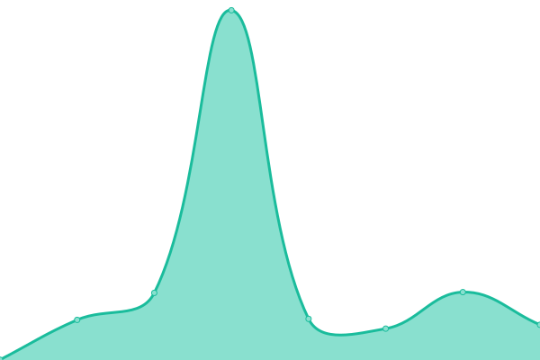
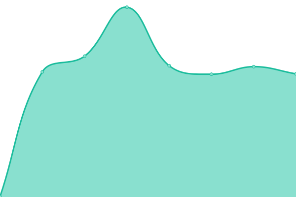

# [📈 Live Status](https://uptime.soneji.xyz): <!--live status--> **🟧 Partial outage**

This repository contains the open-source uptime monitor and status page for [Dhaval Soneji](https://soneji.xyz), powered by [Upptime](https://github.com/upptime/upptime).

With [Upptime](https://upptime.js.org), you can get your own unlimited and free uptime monitor and status page, powered entirely by a GitHub repository. We use [Issues](https://github.com/soneji/upptime/issues) as incident reports, [Actions](https://github.com/soneji/upptime/actions) as uptime monitors, and [Pages](https://uptime.soneji.xyz) for the status page.

<!--start: status pages-->
<!-- This summary is generated by Upptime (https://github.com/upptime/upptime) -->
<!-- Do not edit this manually, your changes will be overwritten -->
<!-- prettier-ignore -->
| URL | Status | History | Response Time | Uptime |
| --- | ------ | ------- | ------------- | ------ |
|  [soneji.xyz](soneji.xyz) | 🟩 Up | [soneji-xyz.yml](https://github.com/Soneji/uptime/commits/HEAD/history/soneji-xyz.yml) | 

 438ms
     
 | 

<a href="https://uptime.soneji.xyz/history/soneji-xyz">100.00%</a>
    

|  [dhavalsoneji.com](dhavalsoneji.com) | 🟩 Up | [dhavalsoneji-com.yml](https://github.com/Soneji/uptime/commits/HEAD/history/dhavalsoneji-com.yml) | 

 45ms
     
 | 

<a href="https://uptime.soneji.xyz/history/dhavalsoneji-com">100.00%</a>
    

|  [Spotify Vibe Check](spotify.soneji.xyz) | 🟩 Up | [spotify-vibe-check.yml](https://github.com/Soneji/uptime/commits/HEAD/history/spotify-vibe-check.yml) | 

 603ms
     
 | 

<a href="https://uptime.soneji.xyz/history/spotify-vibe-check">100.00%</a>
    

|  [CTF](https://ctf.soneji.xyz) | 🟩 Up | [ctf.yml](https://github.com/Soneji/uptime/commits/HEAD/history/ctf.yml) | 

 155ms
     
 | 

<a href="https://uptime.soneji.xyz/history/ctf">100.00%</a>
    

|  LTT | 🟥 Down | [ltt.yml](https://github.com/Soneji/uptime/commits/HEAD/history/ltt.yml) | 

 302ms
     
 | 

<a href="https://uptime.soneji.xyz/history/ltt">100.00%</a>
    

|  [Shynet Analytics](https://shynetanalytics.com) | 🟥 Down | [shynet-analytics.yml](https://github.com/Soneji/uptime/commits/HEAD/history/shynet-analytics.yml) | 

 396ms
     
 | 

<a href="https://uptime.soneji.xyz/history/shynet-analytics">0.00%</a>
    

|  Venom | 🟩 Up | [venom.yml](https://github.com/Soneji/uptime/commits/HEAD/history/venom.yml) | 

 174ms
     
 | 

<a href="https://uptime.soneji.xyz/history/venom">100.00%</a>
    

|  Javamail | 🟩 Up | [javamail.yml](https://github.com/Soneji/uptime/commits/HEAD/history/javamail.yml) | 

 240ms
     
 | 

<a href="https://uptime.soneji.xyz/history/javamail">99.20%</a>
    

|  [GitHub Pages](https://github.soneji.xyz) | 🟩 Up | [git-hub-pages.yml](https://github.com/Soneji/uptime/commits/HEAD/history/git-hub-pages.yml) | 

 104ms
     
 | 

<a href="https://uptime.soneji.xyz/history/git-hub-pages">100.00%</a>
    

|  NextCloud | 🟩 Up | [next-cloud.yml](https://github.com/Soneji/uptime/commits/HEAD/history/next-cloud.yml) | 

 481ms
     
 | 

<a href="https://uptime.soneji.xyz/history/next-cloud">100.00%</a>
    

|  [FileBrowser](https://fs.soneji.xyz) | 🟩 Up | [file-browser.yml](https://github.com/Soneji/uptime/commits/HEAD/history/file-browser.yml) | 

 411ms
     
 | 

<a href="https://uptime.soneji.xyz/history/file-browser">100.00%</a>
    

|  Plex | 🟩 Up | [plex.yml](https://github.com/Soneji/uptime/commits/HEAD/history/plex.yml) | 

 413ms
     
 | 

<a href="https://uptime.soneji.xyz/history/plex">100.00%</a>
    

|  QB | 🟩 Up | [qb.yml](https://github.com/Soneji/uptime/commits/HEAD/history/qb.yml) | 

 381ms
     
 | 

<a href="https://uptime.soneji.xyz/history/qb">100.00%</a>
    

|  VHM | 🟥 Down | [vhm.yml](https://github.com/Soneji/uptime/commits/HEAD/history/vhm.yml) | 

 364ms
     
 | 

<a href="https://uptime.soneji.xyz/history/vhm">99.77%</a>
    

|  HHM | 🟩 Up | [hhm.yml](https://github.com/Soneji/uptime/commits/HEAD/history/hhm.yml) | 

 254ms
     
 | 

<a href="https://uptime.soneji.xyz/history/hhm">100.00%</a>
    

<!--end: status pages-->

[**Visit our status website →**](https://uptime.soneji.xyz)

## 📄 License

- Powered by: [Upptime](https://github.com/upptime/upptime)
- Code: [MIT](./LICENSE) © [Dhaval Soneji](https://soneji.xyz)
- Data in the `./history` directory: [Open Database License](https://opendatacommons.org/licenses/odbl/1-0/)
